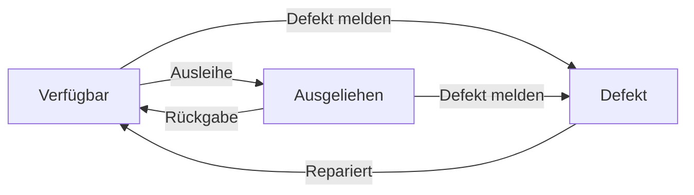
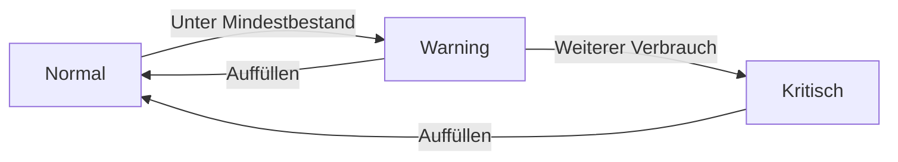

# Scandy - Applikationsstruktur

## Einführung
Scandy ist eine Webanwendung zur Verwaltung von Werkzeugen und Verbrauchsmaterialien in einem Unternehmen. Die Anwendung ermöglicht es Mitarbeitern, Werkzeuge auszuleihen, Verbrauchsmaterialien zu entnehmen und den Bestand zu verwalten. Die App wurde mit Flask entwickelt und verwendet SQLite als Datenbank.

## Verzeichnisstruktur
```
scandy/
├── app/                      # Hauptverzeichnis der Flask-Anwendung
│   ├── database/            # SQLite-Datenbanken
│   │   ├── inventory.db     # Hauptdatenbank für Werkzeuge und Materialien
│   │   └── users.db         # Benutzerdatenbank für Authentifizierung
│   ├── models/              # Datenbankmodelle
│   │   ├── database.py      # Zentrale Datenbankklasse für Verbindungen
│   │   ├── tool.py          # Werkzeug-Modell mit Status und Ausleihe
│   │   ├── worker.py        # Mitarbeiter-Modell mit Berechtigungen
│   │   ├── consumable.py    # Verbrauchsmaterial-Modell mit Bestand
│   │   └── user.py          # Benutzer-Modell für Login
│   ├── routes/              # Flask Blueprints (Controller)
│   │   ├── tools.py         # Werkzeug-Routen für CRUD-Operationen
│   │   ├── workers.py       # Mitarbeiter-Routen für Verwaltung
│   │   ├── consumables.py   # Verbrauchsmaterial-Routen
│   │   ├── auth.py          # Authentifizierung und Login
│   │   ├── lending.py       # Ausleihe-System für Werkzeuge
│   │   └── api.py           # API-Endpunkte für Frontend
│   ├── static/              # Statische Dateien
│   │   ├── css/             # Stylesheets für das Design
│   │   ├── js/              # JavaScript für Interaktivität
│   │   └── images/          # Bilder und Icons
│   ├── templates/           # Jinja2 Templates
│   │   ├── base.html        # Basis-Layout für alle Seiten
│   │   ├── tools/           # Templates für Werkzeugverwaltung
│   │   ├── workers/         # Templates für Mitarbeiterverwaltung
│   │   └── consumables/     # Templates für Materialverwaltung
│   ├── utils/               # Hilfsfunktionen
│   │   ├── decorators.py    # Flask-Dekoratoren für Berechtigungen
│   │   └── auth_utils.py    # Authentifizierungshilfen
│   ├── __init__.py          # App-Factory für Flask
│   ├── config.py            # Konfiguration der Anwendung
│   └── wsgi.py              # WSGI-Einstiegspunkt für Produktion
├── backups/                 # Automatische Datenbank-Backups
├── venv/                    # Virtuelle Python-Umgebung
├── requirements.txt         # Python-Abhängigkeiten
├── start.sh                 # Startskript für den Server
└── README.md                # Projekt-Dokumentation
```

## Hauptkomponenten

### Datenbank
Die Anwendung verwendet SQLite als Datenbank, was für lokale Installationen ideal ist. Die Datenbank ist in zwei Dateien aufgeteilt:
- `inventory.db`: Enthält alle Daten zu Werkzeugen, Materialien und Ausleihen
- `users.db`: Verwaltet Benutzer und Berechtigungen

Die wichtigsten Tabellen sind:
- `tools`: Speichert Werkzeuge mit Status und Ausleihinformationen
- `workers`: Enthält Mitarbeiterdaten und Berechtigungen
- `consumables`: Verwaltet Verbrauchsmaterialien und Bestände
- `lendings`: Protokolliert Ausleihvorgänge
- `consumable_usages`: Zeichnet Materialverbrauch auf
- `users`: Speichert Benutzerkonten und Rollen

### Authentifizierung
Die Authentifizierung basiert auf Flask-Login und bietet:
- Benutzer-Login mit Passwort
- Rollenbasierte Zugriffskontrolle (Admin/Benutzer)
- Session-Management
- Sichere Passwort-Speicherung

### API-Endpunkte
Die Anwendung bietet eine RESTful API für:
- Werkzeugverwaltung (CRUD-Operationen)
- Materialverwaltung
- Ausleihsystem
- Benutzerverwaltung

### Frontend
Das Frontend ist modern und benutzerfreundlich:
- Responsive Design für alle Geräte
- Dynamische Updates ohne Seitenneuladen
- Barcode-Scanner-Integration
- Echtzeit-Benachrichtigungen

## Technische Details

### Datenbank-Schema
```sql
-- Werkzeuge: Speichert alle Werkzeuge mit Status und Ausleihinformationen
CREATE TABLE tools (
    barcode TEXT PRIMARY KEY,      -- Eindeutiger Barcode des Werkzeugs
    name TEXT NOT NULL,            -- Bezeichnung des Werkzeugs
    category TEXT NOT NULL,        -- Kategorie (z.B. Handwerkzeug)
    location TEXT NOT NULL,        -- Lagerort
    status TEXT NOT NULL,          -- Status (verfügbar/ausgeliehen/defekt)
    description TEXT,              -- Beschreibung
    defect_reason TEXT,            -- Grund für Defekt
    lent_to TEXT,                  -- Ausgeliehen an
    lent_at TIMESTAMP              -- Ausleihdatum
);

-- Verbrauchsmaterialien: Verwaltet Materialien und Bestände
CREATE TABLE consumables (
    barcode TEXT PRIMARY KEY,      -- Eindeutiger Barcode
    name TEXT NOT NULL,            -- Bezeichnung
    category TEXT NOT NULL,        -- Kategorie
    location TEXT NOT NULL,        -- Lagerort
    minimum_stock INTEGER NOT NULL, -- Mindestbestand
    current_stock INTEGER NOT NULL, -- Aktueller Bestand
    unit TEXT NOT NULL             -- Einheit (Stück, Meter, etc.)
);

-- Mitarbeiter: Verwaltet Mitarbeiterdaten
CREATE TABLE workers (
    id INTEGER PRIMARY KEY AUTOINCREMENT,
    name TEXT NOT NULL,            -- Name des Mitarbeiters
    barcode TEXT UNIQUE NOT NULL,  -- Mitarbeiter-Barcode
    active BOOLEAN DEFAULT 1       -- Aktiv/Inaktiv
);

-- Ausleihen: Protokolliert Werkzeugausleihen
CREATE TABLE tool_lendings (
    id INTEGER PRIMARY KEY AUTOINCREMENT,
    tool_barcode TEXT NOT NULL,    -- Barcode des Werkzeugs
    worker_id INTEGER NOT NULL,    -- ID des Mitarbeiters
    lent_at TIMESTAMP DEFAULT CURRENT_TIMESTAMP, -- Ausleihdatum
    returned_at TIMESTAMP,         -- Rückgabedatum
    lending_reason TEXT,           -- Grund der Ausleihe
    FOREIGN KEY (tool_barcode) REFERENCES tools(barcode),
    FOREIGN KEY (worker_id) REFERENCES workers(id)
);

-- Verbrauchsmaterial-Verbrauch: Zeichnet Materialentnahmen auf
CREATE TABLE consumable_usages (
    id INTEGER PRIMARY KEY AUTOINCREMENT,
    consumable_barcode TEXT NOT NULL,  -- Barcode des Materials
    worker_id INTEGER NOT NULL,        -- ID des Mitarbeiters
    quantity INTEGER NOT NULL,         -- Entnommene Menge
    usage_date TIMESTAMP DEFAULT CURRENT_TIMESTAMP, -- Entnahmedatum
    usage_reason TEXT,                 -- Grund der Entnahme
    FOREIGN KEY (consumable_barcode) REFERENCES consumables(barcode),
    FOREIGN KEY (worker_id) REFERENCES workers(id)
);
```

### App Factory Pattern
Die Anwendung verwendet das Factory Pattern für eine saubere Initialisierung:
```python
def create_app(config=None):
    app = Flask(__name__)
    
    # Default Konfiguration laden
    app.config.from_object('config.Config')
    
    # Optionale Konfiguration überschreiben
    if config:
        app.config.update(config)
    
    # Erweiterungen initialisieren
    Session(app)      # Session-Management
    Compress(app)     # Kompression für statische Dateien
    
    # Blueprints registrieren
    from .routes import admin, tools, consumables, workers
    app.register_blueprint(admin.bp)        # Admin-Bereich
    app.register_blueprint(tools.bp)        # Werkzeugverwaltung
    app.register_blueprint(consumables.bp)  # Materialverwaltung
    app.register_blueprint(workers.bp)      # Mitarbeiterverwaltung
    
    # Template Filter registrieren
    from .utils.filters import format_datetime
    app.jinja_env.filters['format_datetime'] = format_datetime
    
    return app
```

### Datenbank-Verbindung
Die Datenbankverbindung wird über eine zentrale Klasse verwaltet:
```python
class Database:
    def __init__(self):
        self.db_path = current_app.config['DATABASE']
        
    def get_db(self):
        # Verbindung zur Datenbank herstellen
        db = sqlite3.connect(
            self.db_path,
            detect_types=sqlite3.PARSE_DECLTYPES
        )
        db.row_factory = sqlite3.Row  # Ergebnisse als Dictionary
        return db
        
    def query_db(self, query, args=(), one=False):
        # Datenbankabfrage ausführen
        db = self.get_db()
        cur = db.execute(query, args)
        rv = cur.fetchall()
        db.close()
        return (rv[0] if rv else None) if one else rv
```

### Route Blueprints
Die Anwendung ist in Blueprints organisiert, z.B. für die Werkzeugverwaltung:
```python
bp = Blueprint('tools', __name__, url_prefix='/tools')

@bp.route('/detail/<barcode>')
def detail(barcode):
    # Werkzeugdetails anzeigen
    db = Database()
    tool = db.query_db('SELECT * FROM tools WHERE barcode = ?', [barcode], one=True)
    if tool is None:
        abort(404)  # Werkzeug nicht gefunden
    history = db.query_db(TOOL_HISTORY_QUERY, [barcode])
    return render_template('tools/details.html', tool=tool, history=history)
```

### Template Logic
Die Templates verwenden Jinja2 für dynamische Inhalte:
```html



<div class="tool-details">
    <h1>{{ tool.name }}</h1>
    <div class="status-badge {{ tool.status }}">
        {{ tool.status }}
    </div>
    
    <div class="tool-info">
        <p>Barcode: {{ tool.barcode }}</p>
        <p>Kategorie: {{ tool.category }}</p>
        <p>Standort: {{ tool.location }}</p>
        
        <p>Ausgeliehen an: {{ tool.lent_to }}</p>
        <p>Ausleihdatum: {{ tool.lent_at|format_datetime }}</p>
        
    </div>
    
    <div class="history">
        <h2>Historie</h2>
        
        <div class="history-entry">
            <span class="action-type">{{ entry.action_type }}</span>
            <span class="action-date">{{ entry.action_date|format_datetime }}</span>
            <p>{{ entry.description }}</p>
        </div>
        
    </div>
</div>

```

### JavaScript Event Handlers
Die Frontend-Interaktivität wird durch JavaScript gesteuert:
```javascript
// tools.js: Werkzeugverwaltung
document.addEventListener('DOMContentLoaded', () => {
    setupToolHandlers();          // Werkzeugaktionen
    setupStatusChangeHandlers();  // Statusänderungen
    setupSearchHandlers();        // Suche
    setupQuickScanHandlers();     // Barcode-Scan
});

// consumables.js: Materialverwaltung
document.addEventListener('DOMContentLoaded', () => {
    setupStockHandlers();         // Bestandsverwaltung
    setupUsageHandlers();         // Materialentnahme
    setupSearchHandlers();        // Suche
    setupQuickScanHandlers();     // Barcode-Scan
});

// quickscan.js: Schnellzugriff
document.addEventListener('DOMContentLoaded', () => {
    setupBarcodeScanner();        // Scanner-Integration
    setupAutoSubmit();            // Automatische Formularübermittlung
    setupErrorHandling();         // Fehlerbehandlung
});
```

### Error Handling
Die Anwendung verwendet ein zentrales Fehlerbehandlungssystem:
```python
ERROR_CODES = {
    'TOOL_NOT_FOUND': ('T001', 'Werkzeug nicht gefunden'),
    'TOOL_ALREADY_LENT': ('T002', 'Werkzeug bereits ausgeliehen'),
    'INVALID_STATUS': ('T003', 'Ungültiger Status'),
    'CONSUMABLE_NOT_FOUND': ('C001', 'Verbrauchsmaterial nicht gefunden'),
    'INSUFFICIENT_STOCK': ('C002', 'Nicht genügend Bestand'),
    'WORKER_NOT_FOUND': ('W001', 'Mitarbeiter nicht gefunden'),
    'WORKER_INACTIVE': ('W002', 'Mitarbeiter nicht aktiv'),
    'DB_ERROR': ('D001', 'Datenbankfehler'),
    'VALIDATION_ERROR': ('V001', 'Validierungsfehler'),
    'SCAN_ERROR': ('S001', 'Barcode-Scan fehlgeschlagen'),
    'MIGRATION_ERROR': ('M001', 'Datenbankmigration fehlgeschlagen')
}
```

### Security Considerations
Die Sicherheit wird auf mehreren Ebenen gewährleistet:
```python
# CSRF-Schutz: Verhindert Cross-Site Request Forgery
app.config['WTF_CSRF_SECRET_KEY'] = 'random-key-for-csrf'
csrf = CSRFProtect(app)

# XSS-Schutz: Verhindert Cross-Site Scripting
app.jinja_env.autoescape = True

# SQL-Injection Prevention: Verhindert SQL-Injection
def query_db(self, query, args=(), one=False):
    cur = self.get_db().execute(query, args)
    return cur.fetchone() if one else cur.fetchall()

# Session-Sicherheit: Schützt Benutzersitzungen
app.config['SESSION_COOKIE_SECURE'] = True
app.config['SESSION_COOKIE_HTTPONLY'] = True
app.config['SESSION_COOKIE_SAMESITE'] = 'Lax'
```

### Performance Optimizations
Die Performance wird durch verschiedene Maßnahmen optimiert:
```python
# Query-Optimierungen: Optimierte SQL-Abfragen
OPTIMIZED_QUERIES = {
    'tool_detail': '''
        SELECT t.*, 
            w.name as worker_name,
            tl.lent_at as lending_date,
            COUNT(DISTINCT tsc.id) as status_changes,
            COUNT(DISTINCT tlh.id) as lending_history
        FROM tools t
        LEFT JOIN tool_lendings tl ON t.barcode = tl.tool_barcode 
            AND tl.returned_at IS NULL
        LEFT JOIN workers w ON tl.worker_id = w.id
        LEFT JOIN tool_status_changes tsc ON t.barcode = tsc.tool_barcode
        LEFT JOIN tool_lendings tlh ON t.barcode = tlh.tool_barcode
        WHERE t.barcode = ?
        GROUP BY t.barcode
    '''
}

# Caching-Strategien: Verbessert die Antwortzeiten
CACHE_CONFIG = {
    'CACHE_TYPE': 'filesystem',
    'CACHE_DIR': 'flask_cache',
    'CACHE_DEFAULT_TIMEOUT': 300,
    'CACHE_THRESHOLD': 1000,
    'CACHE_OPTIONS': {
        'mode': 0o600,
        'ignore_errors': True
    }
}
```

### Background Tasks
Hintergrundaufgaben werden automatisch ausgeführt:
```python
def schedule_tasks():
    scheduler = APScheduler()
    scheduler.init_app(app)
    scheduler.start()
    
    # Tägliche Bestandsprüfung
    @scheduler.task('cron', id='check_stock', hour=0)
    def check_stock():
        db = Database()
        low_stock = db.query_db('''
            SELECT * FROM consumables 
            WHERE current_stock <= minimum_stock
        ''')
        if low_stock:
            send_stock_notification(low_stock)
    
    # Wöchentliche Backups
    @scheduler.task('cron', id='backup_db', day_of_week='sun')
    def backup_database():
        backup_path = f'backups/scandy_{datetime.now():%Y%m%d}.db'
        shutil.copy2('instance/scandy.db', backup_path)
    
    # Tägliche Datenbankwartung
    @scheduler.task('cron', id='db_maintenance', hour=2)
    def perform_db_maintenance():
        db = Database()
        db.execute('VACUUM')
        db.execute('ANALYZE')
```

### Deployment Checklist
Vor dem Deployment müssen folgende Punkte überprüft werden:
```python
DEPLOYMENT_CHECKS = {
    'database': [
        'instance/scandy.db exists',
        'correct permissions',
        'tables created',
        'indices created',
        'triggers created',
        'migrations applied'
    ],
    'static_files': [
        'tailwind.css compiled',
        'js files minified',
        'correct permissions',
        'barcode scanner configured'
    ],
    'environment': [
        'all dependencies installed',
        'correct Python version',
        'environment variables set',
        'logging configured',
        'backup system configured'
    ],
    'security': [
        'debug mode off',
        'secret key set',
        'csrf protection enabled',
        'secure headers configured',
        'session security configured'
    ],
    'performance': [
        'caching enabled',
        'database indices created',
        'query optimization applied',
        'static file compression enabled'
    ]
}
```

## Geschäftsregeln

### Werkzeug-Management
Die Werkzeugverwaltung folgt strikten Regeln:
```python
TOOL_RULES = {
    'lending': {
        'requires_active_worker': True,    # Nur aktive Mitarbeiter
        'max_items_per_worker': None,      # Kein Limit
        'requires_reason': False,          # Grund optional
        'auto_status_update': True         # Status automatisch aktualisieren
    },
    'status_change': {
        'allowed_by_admin': True,          # Nur Admins dürfen Status ändern
        'allowed_by_user': False,
        'requires_reason': True,           # Grund erforderlich
        'restricted_when_lent': True       # Keine Änderung bei Ausleihe
    }
}
```

### Verbrauchsmaterial-Management
Die Materialverwaltung hat eigene Regeln:
```python
CONSUMABLE_RULES = {
    'usage': {
        'requires_active_worker': True,    # Nur aktive Mitarbeiter
        'check_stock_level': True,         # Bestand prüfen
        'allow_negative_stock': False,     # Keine negativen Bestände
        'requires_reason': False           # Grund optional
    },
    'stock_update': {
        'allowed_by_admin': True,          # Nur Admins dürfen Bestand ändern
        'allowed_by_user': False,
        'requires_reason': True,           # Grund erforderlich
        'log_changes': True                # Änderungen protokollieren
    }
}
```

## Systemzustände und Übergänge

### Werkzeugstatus-Übergänge
Werkzeuge können verschiedene Zustände durchlaufen:


### Verbrauchsmaterial-Bestandszustände
Materialien haben verschiedene Bestandszustände:


## Fehlerbehandlungs-Strategien

### Datenbankfehler
Datenbankfehler werden systematisch behandelt:
```python
DB_ERROR_STRATEGIES = {
    'connection_lost': {
        'max_retries': 3,          # Maximal 3 Versuche
        'retry_delay': 1,          # 1 Sekunde Wartezeit
        'fallback': 'error_page'   # Fehlerseite anzeigen
    },
    'constraint_violation': {
        'log_level': 'WARNING',    # Warnung loggen
        'user_message': True,      # Benutzer informieren
        'rollback': True           # Transaktion rückgängig machen
    },
    'data_integrity': {
        'log_level': 'ERROR',      # Fehler loggen
        'notify_admin': True,      # Admin benachrichtigen
        'maintenance_mode': True   # Wartungsmodus aktivieren
    }
}
```

### Benutzerinteraktions-Fehler
Fehler in der Benutzerinteraktion werden benutzerfreundlich behandelt:
```python
UI_ERROR_STRATEGIES = {
    'invalid_barcode': {
        'show_message': True,      # Fehlermeldung anzeigen
        'clear_input': True,       # Eingabe löschen
        'focus_field': True        # Feld fokussieren
    },
    'form_validation': {
        'highlight_fields': True,  # Fehlerfelder markieren
        'show_summary': True,      # Zusammenfassung anzeigen
        'preserve_data': True      # Daten behalten
    },
    'session_expired': {
        'redirect': 'login',       # Zum Login weiterleiten
        'save_state': True,        # Zustand speichern
        'show_message': True       # Meldung anzeigen
    }
}
```